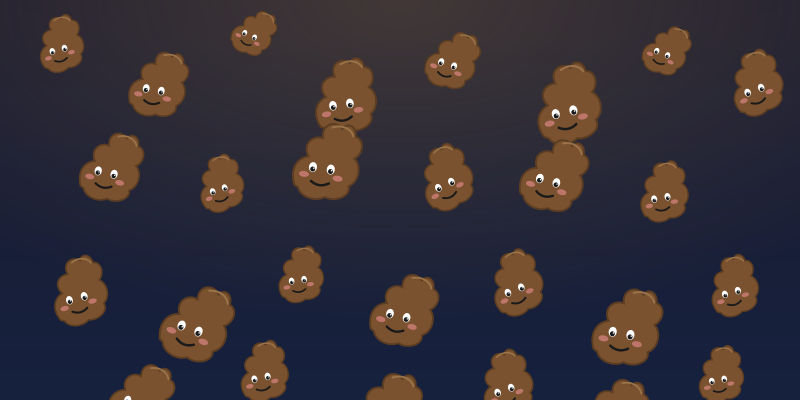

  

# slop

> A collection of AI slops created because I didn't want to waste the remaining tokens right before the token limit resets.

A repository for collecting AI slops generated to avoid wasting leftover tokens just before the token limit resets. Any project is welcome, regardless of language, stack, or topic.

## Rules

- **Folder-based**: Every project must live in its own dedicated folder.
- **Web service**: Projects must ultimately be web services that can be hosted on [GitHub Pages](https://docs.github.com/en/pages).
- **Topic/stack agnostic**: There are no restrictions on language, framework, or subject.
- **Legal compliance**: Content that violates the laws of the Republic of Korea or [GitHub's policies](https://docs.github.com/en/site-policy) is not permitted.

## Contributing

1. Create a new folder for your project.
2. Add your code along with a brief `README.md`.
3. Commit and push.

## Disclaimer

All content in this repository is "slop"—experimental output produced quickly to burn through tokens. No guarantees are made regarding quality or accuracy.
